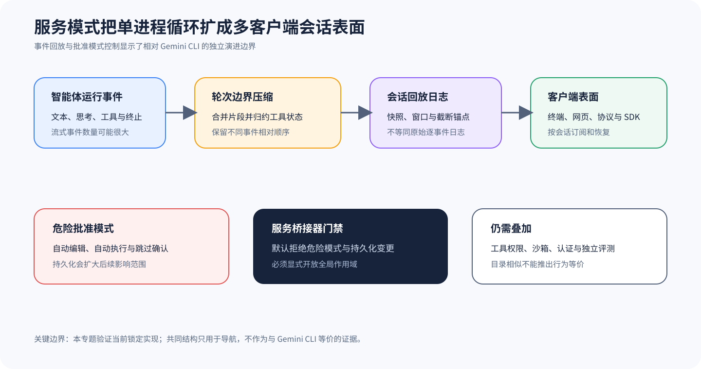

# Qwen Code：Serve 回放与批准作用域

## 为什么值得单独看

Qwen Code 和 Gemini CLI 有一些容易辨认的共同结构与概念。不过，当前锁定的仓库已经加入了规模可观的 Serve、Daemon、SDK 和多 ClientSession 能力，也实现了基于 ACP（Agent 客户端协议）的 Bridge。这里不考证历史谱系，也不会因为目录相似就认定行为相同。我们只看当前源码能直接核对的两套机制：系统怎样按 Turn（回合）压缩 Event 回放，以及 Serve Bridge（服务桥接层）怎样限制高风险 Approval 模式。

Agent Harness（智能体框架）一旦变成长驻 Server，又同时服务多个客户端，就会遇到单进程 CLI 里不太显眼的问题。Stream（流）里的事件很多，系统必须在内存占用和恢复能力之间取舍。远端 Tool 还可能改变会话的审批模式，因此代码必须限制这种变化影响哪个作用域，以及能否持久保存。这两套机制补充了六条一级主线里的协议与会话视角，但不会把 Qwen Code 变成新的综合主线。

## 轮次回放压缩与批准作用域

`TurnBoundaryCompactionEngine` 遇到 `turn_complete` 或 `turn_error` 时，会折叠当前 Turn 积累的事件。它合并连续文本和思考 Chunk（数据块），把 Tool Call（工具调用）序列收拢到最终状态，丢掉瞬态信号，同时保留不同事件类型原有的相对顺序。处理之后，回放日志只会随着对话轮数增长，不再随着每个流式 Token 一起膨胀。

Compression（压缩）能减少内存占用和回放成本，也会让证据变粗。系统一旦丢掉瞬态信号，就无法再从压缩日志里复原，工具调用只留下归约后的状态，中间怎样变化也可能看不到。源码还限制了回放字节数、事件数、Journal 增长量和截断锚点，所以长会话的窗口仍会淘汰旧记录。旧记录会消失。这是有损取舍。压缩日志适合帮助客户端恢复和展示界面，却替代不了高保真的审计 Trace。

Serve Bridge 还提供了一个工具，让调用方改变会话的审批模式，它接受 plan、default、auto-edit、auto 和 yolo 五个值。不过，只要 `allowGlobalScope` 没有开启，代码就会明确拒绝 auto-edit、auto、yolo，也不允许把变化持久保存。只有调用方明确开放全局作用域，请求才会交给 DaemonClient。

这道门禁只管远端 Bridge 表面怎样扩大风险，它可以阻止普通桥接调用悄悄把会话切到更自动的执行 Mode，也能阻止调用方把变化写入工作区 Settings，继续影响后面的会话。但它不构成完整的安全边界，直接 CLI、其他 API 表面、工具本身和 Sandbox 各有自己的 Policy。一旦开放全局作用域，还要记录谁发起调用、改了哪个会话，以及变化会保存多久、影响多大范围。

## 从哪里开始读源码

先读 [`TurnBoundaryCompactionEngine`](https://github.com/QwenLM/qwen-code/blob/4d3f9ff5719157fda5e8b135ed5bc362d925bcf0/packages/acp-bridge/src/compactionEngine.ts#L232-L301)，看类说明怎样解释预算字段、回放片段和截断锚点。再跟到 ingest、轮次结束和 Snapshot，记下代码合并了哪些事件、丢掉了哪些事件、何时生成历史截断标记，以及客户端怎样取得先前记录。

审批作用域要从 [`workspaceWrite` 的模式变更工具](https://github.com/QwenLM/qwen-code/blob/4d3f9ff5719157fda5e8b135ed5bc362d925bcf0/packages/sdk-typescript/src/daemon-mcp/serve-bridge/tools/workspaceWrite.ts#L81-L115) 读起。这几层不能混。注意分清四件事：枚举允许写哪些值，默认作用域放行哪些值，变化能否持久保存，最终改的是哪个会话 ID。工具描述列出了某种模式，不代表默认门禁一定放行。

## 把实时事件、回放窗口和会话控制连起来

实时 Journal 在 Turn 完成或出错时，才会产出回放片段。引擎先在当前 Turn 内接收增量事件，按类型合并文本和思考，收拢工具状态，并保留不同类型之间的顺序，然后才把片段放进受字节和事件预算约束的窗口。系统要记录压缩前后的数量、丢弃的类型、截断锚点和当前 Cursor，客户端看到这些信息，才能知道自己恢复的是有损投影，不是完整 Trace。

多个客户端通过「快照加增量」读取同一个回放窗口，客户端先取得窗口快照和锚点，再订阅新事件。断线重连时，它用 Cursor 去掉重复事件，如果要续读的位置已经被淘汰，系统就应返回明确的截断状态。原始证据要另存。高风险工具的原始调用、审批和 Result 应写进另一条不可变审计流，不能只依赖为 UI 优化的压缩 Journal。

`allowGlobalScope` 守在 Serve Bridge 通往会话控制 API 的入口，代码先校验模式、是否想持久保存，以及请求的作用域，默认只允许影响较小的变化。即使开放全局作用域，记录里仍要绑定调用者、目标 Session、旧值、新值和有效期。模式变化只会改动应用的审批策略，Executor 和操作系统隔离仍要各自判断。

## 沿一次长驻会话走完整链

1. Agent 运行产生文本、思考、工具调用、权限与轮次终止等流式事件。
2. ACP Bridge 在轮次进行中维护实时 Journal，并在完成或错误边界执行折叠。
3. 压缩片段进入受字节与事件预算约束的回放窗口，必要时保留截断锚点。
4. 终端、网页、协议客户端或 SDK 按会话订阅、重连并读取回放状态。
5. 若客户端通过 Serve Bridge 改批准模式，先经过全局作用域门禁，再调用会话控制 API。
6. 独立评测读取真实产物和所需原始证据，不把回放完成或批准变更当作任务通过。

要追清一段运行，记录里应当同时包含 session ID、事件 ID、轮次边界、压缩前后的数量、截断计数、记录锚点、客户端订阅位置，以及审批模式怎样变化。若 Task 风险较高，还要另外保存不可修改的原始工具调用与结果。客户端回放日志原本就有意做了有损优化。

## 它补充了六条主课程的什么

Gemini CLI 一级主线只根据锁定的 Gemini 源码，解释它怎样处理 Config、调度、工具和会话。Qwen Code 样本则根据自己的锁定 Commit 解释 Serve 扩展。两者可以沿同一组维度比较，但包名、目录或早期关系都不能让一边替另一边作证。所谓「同源」只能帮助定位。判断行为时，仍要回到各自源码和测试。

这个样本也给其他主线提出两个通用问题。长驻 Harness 同时向多个客户端提供会话时，怎样限制回放范围？Permission 模式能否通过 Protocol 表面从远端扩大？Codex、Claude、pi、OpenCode 和 DeepSeek Harness 都要按自己的实现回答，不能直接套用 Qwen Code 的字段或默认值。

## 什么时候值得采用

如果事件量远大于轮数，客户端又要快速重连，而 UI 不要求逐 Token 审计，那么在轮次边界做压缩很合适。可是一旦要调试流式解析、做合规取证，或者操作高风险工具，就必须同时保留保真度更高的证据。窗口预算越小，恢复成本越高，看不到的历史也越多。因此，预算要根据任务风险来定。

Bridge 的作用域门禁可以阻止普通远端工具扩大自动审批范围，也能拦住它们持久修改设置，但只能保护这一个入口。直接 CLI、其他 Agent SDK、配置文件和组织策略都要分别核对。这里不会因为 Qwen Code 与 Gemini CLI 结构相似，就推断两者语义相同，也不评价 Qwen Code 的全部产品表面。真正可以借鉴的，是明确告诉客户端回放有损，用快照和 Cursor 续读，并审计权限怎样扩大。

## 最容易误判的地方

第一类风险，是看到压缩回放保留了相对顺序，就把它当成完整审计。中间事件仍可能被丢弃，截断窗口还会淘汰旧轮次。第二类风险，是把 Bridge 的默认门禁当成全系统策略。它只管 Daemon MCP Serve Bridge 这条工具路径，其他入口仍要逐个检查。

第三类风险，是因为两个仓库同源，就认定行为等价。即使它们仍有共同结构，独立演进也会改动配置优先级、工具策略、协议事件和 Resume 语义。Eval 若混用两套 Harness 的默认值，结果便无法复现。审批模式也只在应用层控制行为，替代不了容器、进程权限、网络和凭证隔离。

## 怎样亲手核对

做回放实验时，可以先构造一个 Turn，放入大量文本分片、思考分片和工具状态变化。然后比较完成边界前后的事件数量与顺序，确认同类片段已经合并，工具状态已经收拢，不同类型之间的相对顺序仍然保留。随后调低窗口预算，主动触发截断，再检查客户端是否收到明确标记和分页锚点。

审批实验先保持默认的 `allowGlobalScope=false`，分别请求 plan、auto-edit、auto、yolo 和持久化 default，确认高风险模式与持久化请求都遭到拒绝。再明确开放全局作用域，检查请求是否真的送到了指定会话。开放门禁不代表操作已经安全获批。实验仍要使用受控工具，并放在隔离环境里运行。

## 读完后做四个判断

### 问题 1

回放压缩是否无损？

**答案：** 不是。它合并片段、归约工具状态并丢弃瞬态信号。

### 问题 2

默认 Bridge 能否切到 yolo？

**答案：** 不能，除非显式开放全局作用域。

### 问题 3

该门禁是否覆盖所有 Qwen Code 入口？

**答案：** 不覆盖，本文结论只描述 Serve Bridge 工具路径。

### 问题 4

与 Gemini CLI 结构相似是否说明行为一致？

**答案：** 不说明，必须分别锁定源码、配置与运行证据。
